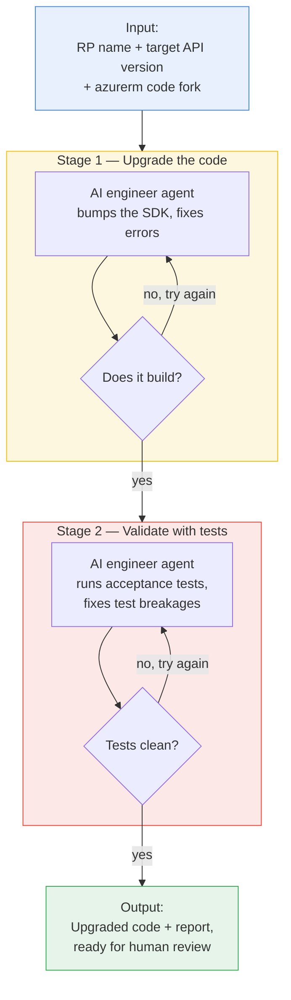
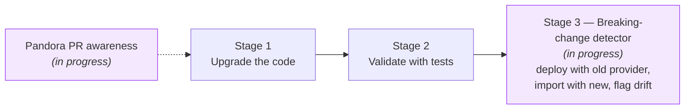

# upgrader — high-level overview

**What it does:** automatically upgrades an Azure Resource Provider (RP) to a newer API
version in our Terraform provider, then proves it still works — with a human reviewing the
final result.

**The core idea (the "Ralph loop"):** an AI agent works in short, repeatable turns. After
each turn it checks a simple pass/fail signal and, if not done, tries again — just like an
engineer iterating until the build and tests are green.

---

## The flow at a glance

---

## Two agents, two jobs

| Agent | Job | "Done" means |
| --- | --- | --- |
| **Upgrade agent** | Update the SDK to the new API version and fix compile errors | Code builds cleanly |
| **Test agent** | Run the acceptance tests, fix test breakages, flag real behavior changes | Tests are clean vs. baseline |

---

## Why it's safe & reviewable

- **Human stays in control** — the tool never commits or pushes; all changes are left for an
  engineer to review and approve.
- **Every step is logged** — a full transcript of each attempt is saved for auditing.
- **Bounded effort** — each stage retries only a set number of times, then stops and reports.
- **Runs in a sandbox** — everything happens in an isolated container against a code copy.

---

## The value

- Turns a slow, repetitive, expert-only chore into a mostly hands-off, overnight run.
- Frees senior engineers to review outcomes instead of doing the mechanical upgrade work.
- Consistent, repeatable process with a clear pass/fail signal and an audit trail.

---

## In progress / coming next

- **Smarter SDK sourcing (Pandora PR awareness)** — teach the upgrade agent to look at the
  upstream Pandora data-source PRs so it can apply the right **workarounds** and
  **bump missing API versions** when a target version isn't yet published in the pinned SDK,
  instead of getting stuck.
- **Breaking-change detector (runs after Stage 2)** — a dedicated step that deploys resources
  with the *released* provider and re-imports them with the *upgraded* provider. If the
  imported state differs, the upgrade silently changed behavior — the tool flags these
  **genuine breaking changes** with evidence for a human, rather than letting them slip through.
- **Better agent guidance (prompts & skills)** — the instructions the agents follow to
  **bump API versions** and **handle breaking changes** are still fairly basic today. They need
  to be refined with more real-world examples and edge cases so the agents make the right call
  more often without human intervention.

---

## The big challenge: full automation

The hardest open problem is running the **entire** pipeline unattended, end to end.

- **Some RPs' acceptance tests take ~10 hours** to complete.
- It's unclear whether **GitHub Actions or Azure DevOps pipelines** can host jobs that long
  (timeouts, runner limits, cost) — so where and how the long-running stages execute is still
  being figured out.
- Until that's solved, the long test/validation stages may need dedicated long-lived runners
  or an alternative execution host rather than standard CI pipelines.
