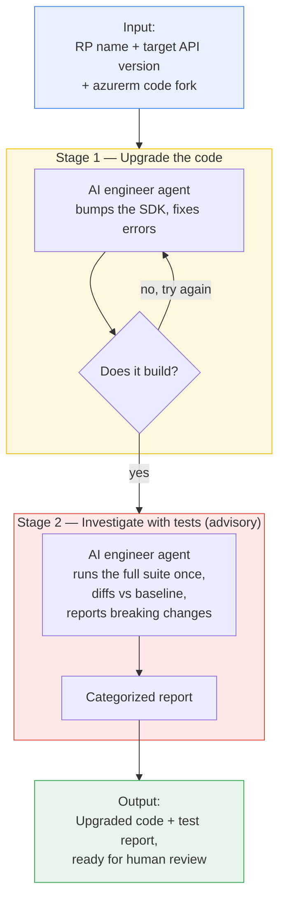
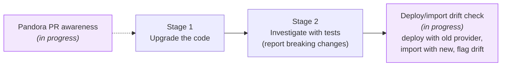

# upgrader — high-level overview

**What it does:** automatically upgrades an Azure Resource Provider (RP) to a newer API
version in our Terraform provider, then runs its acceptance tests once and reports what
broke — with a human reviewing the final result.

**The core idea (the "Ralph loop"):** an AI agent works in short, repeatable turns. After
each turn it checks a simple pass/fail signal and, if not done, tries again — just like an
engineer iterating until the build is green. This loop drives the **upgrade** stage. The
**acctest** stage is deliberately *not* a fix loop: it runs the suite once and produces a
report for a human, because slow, expensive, judgment-heavy test triage is a poor fit for an
autonomous loop.

**Why acctest changed from run↔fix to run-once→analyze:** the old loop re-ran the whole suite
after every fix, so a single change could cost another multi-hour, real-money run — and under
pressure to turn a test green, the agent tended to weaken tests rather than reason about the
API change, while leaked/quota'd resources poisoned later results. Running once and handing a
human a categorized report keeps the fast, objective win (a green build) automated and puts the
slow, correctness-critical judgment where it belongs — with an engineer.

---

## The flow at a glance

---

## Two agents, two jobs

| Agent | Job | "Done" means |
| --- | --- | --- |
| **Upgrade agent** | Update the SDK to the new API version and fix compile errors | Code builds cleanly |
| **Test agent** | Run the full acceptance suite once, diff NEW failures vs. the `main` baseline, and **report** each cause — especially suspected API breaking changes | Every new failure is classified in a report (nothing is auto-fixed) |

---

## Why it's safe & reviewable

- **Human stays in control** — the tool never commits or pushes; all changes are left for an
  engineer to review and approve. The test stage changes no code at all — it only reports.
- **Every step is logged** — a full transcript of each attempt is saved for auditing.
- **Bounded effort** — the upgrade stage retries only a set number of times, then stops; the
  test stage runs once and reports.
- **Tests never fail a good upgrade** — the acctest stage is advisory: a slow or flaky test
  run never overturns a green build.
- **Runs in a sandbox** — everything happens in an isolated container against a code copy.

---

## The value

- Turns a slow, repetitive, expert-only chore into a mostly hands-off, overnight run.
- Frees senior engineers to review outcomes instead of doing the mechanical upgrade work.
- Consistent, repeatable process with a clear pass/fail signal and an audit trail.

---

## In progress / coming next

- **Smarter SDK sourcing (Pandora PR awareness)** — teach the upgrade agent to look at the
  upstream Pandora data-source PRs so it can apply the right **workarounds** and
  **bump missing API versions** when a target version isn't yet published in the pinned SDK,
  instead of getting stuck.
- **Deploy/import drift check (complements Stage 2)** — today Stage 2 detects breaking changes
  by diffing acceptance-test failures against the baseline and researching the API spec. A
  planned addition deploys resources with the *released* provider and re-imports them with the
  *upgraded* provider; if the imported state differs, the upgrade silently changed behavior.
  This catches drift that tests alone might miss, again as **evidence for a human** rather than
  an auto-fix.
- **Better agent guidance (prompts & skills)** — the instructions the agents follow to
  **bump API versions** and **assess breaking changes** are still fairly basic today. They need
  to be refined with more real-world examples and edge cases so the agents make the right call
  more often.

---

## The big challenge: full automation

The hardest open problem is running the **entire** pipeline unattended, end to end.

- **Some RPs' acceptance tests take ~10 hours** to complete.
- It's unclear whether **GitHub Actions or Azure DevOps pipelines** can host jobs that long
  (timeouts, runner limits, cost) — so where and how the long-running stages execute is still
  being figured out.
- Until that's solved, the long test/validation stages may need dedicated long-lived runners
  or an alternative execution host rather than standard CI pipelines.
